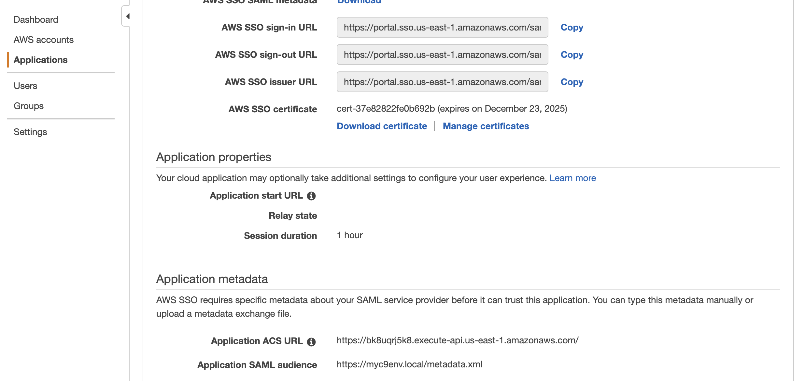
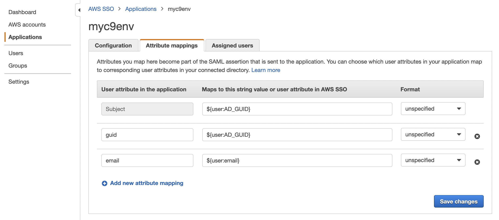
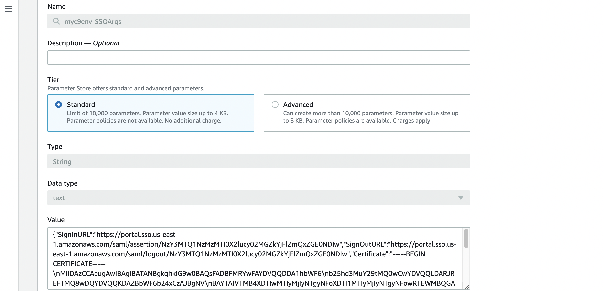

# AWS Cloud9 SSO Integration

:exclamation: **CAUTION:** This project is currently in beta stages. Some resources may not work as expected. Please [report these](https://github.com/iann0036/cloud9-sso/issues) if you find them.

## Installation

### Execution Infrastructure

Click the above link to deploy the stack to your environment. This stack creates a Cloud9 environment and the SAML handling API Gateway / Lambda combination.

If you prefer, you can also manually upsert the [template.yaml](https://github.com/iann0036/cloud9-sso/blob/master/template.yaml) stack from source.

### SSO Setup

_TBC_

